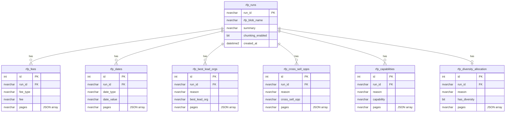

# RFP Summarizer

LLM-based extraction of structured RFP fields with citations, snippets, and optional page images. Uses Azure OpenAI with function calling and supports large documents via page-preserving chunking (RFP Parts).

## Architecture


The system has three deployable components:

| Component | Technology | Purpose |
|---|---|---|
| **Azure Function** | Python 3.11, Flex Consumption | Processes RFPs via Event Grid blob trigger |
| **Backend API** | FastAPI, Azure Container App | Reads results from Azure Blob Storage |
| **Frontend** | React + Vite, Azure Container App | MSAL-authenticated results browser |

```
                    ┌──────────────┐
                    │  React SPA   │──MSAL──▶ Azure AD
                    │ (Container App) │
                    └──────┬───────┘
                           │ Bearer token
                    ┌──────▼───────┐
                    │  FastAPI API  │
                    │ (Container App) │──reads──▶ Blob Storage (outputs)
                    └──────────────┘

    ┌─────────┐   Event Grid   ┌──────────────┐
    │ Storage  │──────────────▶│ Azure Function │──▶ OpenAI (gpt-5-mini)
    │ (uploads)│               │ (Flex Consumption)│──▶ Blob outputs / SQL
    └─────────┘               └──────────────┘
```

## What it does
- Converts PDFs to text with `PAGE NUMBER TO REFERENCE: N` markers using **pdfplumber** (table detection, image rendering)
- Sends system + user prompts to **Azure OpenAI** (`gpt-5-mini`) with function calling
- Extracts and generates 7 structured fields with page citations
- Adds snippet citations by matching extracted values to RFP text chunks
- Supports large RFPs by splitting into RFP Parts (page-preserving) and reconciling
- Writes outputs to **blob storage** or **Azure SQL** (configurable `output_mode`)

## Extracted fields (7)
1. **summary** (generated)
2. **fee** (extracted) — `fee_type`, `fee`, `pages`
3. **date** (extracted) — `date_type`, `date`, `pages`
4. **best_lead_org** (generated) — `reason`, `best_lead_org`, `pages`
5. **cross_sell_opps** (generated) — `reason`, `cross_sell_opps`, `pages`
6. **capabilities_for_rfp** (generated) — `reason`, `capabilities_for_rfp`, `pages`
7. **diversity_allocation** (extracted boolean) — `reason`, `diversity_allocation`, `pages`

## Deployment

All deployment is driven by `deploy/deploy.config.toml`. Scripts live in the `deploy/` folder at repo root and are run from there or the repo root.

```powershell
# 1. Deploy ALL infrastructure (Storage, OpenAI, Function App, ACR, Container Apps, Azure AD, SQL)
.\deploy\deploy-infra.ps1

# 2. Upload prompts and schemas to blob storage
.\deploy\upload-prompts.ps1

# 3. Deploy function code + Event Grid subscription
.\deploy\deploy-function.ps1

# 4. Build Docker images and deploy to Container Apps
.\deploy\deploy-apps.ps1

# 5. Upload capabilities PDF + test RFP (triggers processing)
.\deploy\upload-test-files.ps1
```

### Azure resources created

| Resource | Name Pattern | Notes |
|---|---|---|
| Resource Group | `rg-rfp-summarizer` | |
| Storage Account | `st<prefix>` | Uploads, outputs, prompts, reference containers |
| Azure OpenAI | `aoai-rfp-summarizer` | Standalone OpenAI account with `gpt-5-mini` |
| Function App | `func-rfp-summarizer` | Flex Consumption, Event Grid trigger |
| Container Registry | `acrrfpsummarizer` | Backend + frontend Docker images |
| Container Apps Env | `cae-rfp-summarizer` | Hosts both Container Apps |
| Backend Container App | `api-rfp-summarizer` | Easy Auth (AllowAnonymous + token validation) |
| Frontend Container App | `web-rfp-summarizer` | React SPA with MSAL sign-in |
| Azure SQL Server | `sql-rfp-summarizer` | Only when `output_mode = "sql"` |
| Azure SQL Database | `sqldb-rfp-summarizer` | Only when `output_mode = "sql"` |
| Azure AD App Regs | `api-rfp-summarizer`, `web-rfp-summarizer` | Backend API + Frontend SPA |

### Authentication & Authorization

- **Frontend**: MSAL popup sign-in via Azure AD, acquires a Bearer token scoped to `api://<backend-app-id>/access_as_user`
- **Backend**: Two-layer auth:
  1. Easy Auth (`AllowAnonymous`) lets CORS preflight through and injects identity headers on valid tokens
  2. App-level `EasyAuthMiddleware` (enabled via `AUTH_ENABLED=true`) checks `X-MS-CLIENT-PRINCIPAL` for authentication and **App Roles** for authorization
- **Function App**: Managed Identity with RBAC for Storage and OpenAI

### Role-Based Access Control (RBAC)

Two Azure AD App Roles are defined on the backend app registration:

| Role | Value | Permissions |
|------|-------|-------------|
| **Reader** | `RFP.Reader` | View runs, results, prompts (read-only) |
| **Admin** | `RFP.Admin` | Everything Reader can do + edit prompts and schemas |

Configure role assignments in `deploy.config.toml`:

```toml
[auth]
reader_role = "RFP.Reader"
admin_role = "RFP.Admin"
reader_users = ["user@contoso.com"]
admin_users = ["admin@contoso.com", "security-group-object-id"]
```

The deployer is automatically assigned the Admin role. The Admin tab in the frontend is visible to all users but grayed out for non-admins with a tooltip prompting them to request the `RFP.Admin` role.

### Output modes

Blob storage artifacts (result JSON, source PDF, context, intermediates, metadata) are **always** written regardless of mode. The viewer API always reads from blob.

- **`storage`** (default) — blob storage only
- **`sql`** — blob storage **plus** structured result inserted into Azure SQL (for Power BI / direct queries)

### SQL schema



## Local development

```bash
# Backend API
pip install -r requirements.txt
python -m uvicorn api.main:app --reload

# Frontend
cd frontend
npm install
npm run dev
```

The frontend proxies `/api` to `localhost:8000` in dev mode (no auth required locally).

## Project layout

```
├── deploy/                  # All deployment scripts + config
│   ├── deploy-common.ps1          # Shared helper functions
│   ├── deploy-infra.ps1           # Creates ALL Azure resources
│   ├── upload-prompts.ps1         # Uploads prompts/schemas to blob
│   ├── deploy-function.ps1        # Deploys function code + Event Grid
│   ├── deploy-apps.ps1            # Builds + deploys Container Apps
│   ├── upload-test-files.ps1      # Uploads capabilities + test RFP
│   ├── deploy.config.toml         # Centralized deployment config
│   ├── webapp-env.json            # Generated by deploy-infra (dynamic values)
│   ├── assets/prompts/            # LLM prompt template source files
│   ├── assets/sql/                # SQL schema init script
│   └── test_docs/                 # Capabilities PDF + test RFPs
├── azure-function/          # Azure Function processing engine
│   ├── app/                 # Function app Python code
│   ├── function_app.py      # Entry point (EventGrid + HTTP triggers)
│   └── requirements.txt
├── api/                     # FastAPI viewer backend
│   ├── main.py              # Reads from Azure Blob Storage
│   └── Dockerfile
├── frontend/                # React + Vite viewer frontend
│   ├── src/
│   ├── server.js            # Production Express static server
│   └── Dockerfile
├── requirements.txt         # Backend API dependencies
└── .dockerignore
```
