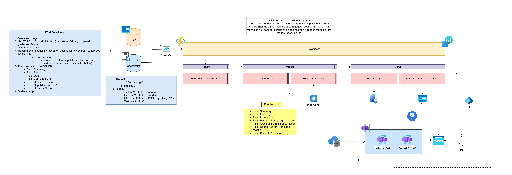

# RFP Summarizer Azure Function

An Azure Functions app that processes RFP (Request for Proposal) PDFs using Azure OpenAI with function calling, extracting structured fields (fee, date, diversity allocation, best lead org, cross-sell opportunities, capabilities) and writing results to blob storage or SQL.

## Architecture



### Workflow

1. **Trigger** -- An RFP PDF is uploaded to the `uploads` blob container. An **Event Grid** subscription detects the new blob and invokes the `RfpBlobTrigger` function.
2. **Extract** -- The PDF is processed by **pdfplumber** for text extraction with per-page granularity, table detection (configurable `min_table_rows`/`min_table_cols`), and optional page/table image rendering. Each page's text is tagged with `PAGE NUMBER TO REFERENCE: N` markers for downstream traceability.
3. **Analyze** -- Each chunk (or the full document) is sent to **Azure OpenAI** (`gpt-5-mini`) using function calling with strict JSON schemas. Prompts and schemas are loaded dynamically from blob storage.
4. **Reconcile** -- When chunked processing produces conflicting extraction candidates, a reconciliation LLM pass resolves them.
5. **Output** -- Artifacts (result JSON, source PDF, context, intermediates, metadata) are **always** written to the `outputs` blob container. When `output_mode = "sql"`, the structured result is **additionally** inserted into Azure SQL for Power BI / direct queries.

### Key Components

| Component | Purpose |
|---|---|
| Event Grid | Delivers blob-created events to the function (Flex Consumption compatible) |
| pdfplumber | PDF text extraction with table detection and page image rendering |
| Azure OpenAI | `gpt-5-mini` with function calling for structured extraction (standalone OpenAI account) |
| Prompts container | Stores LLM prompt templates and function-call JSON schemas |
| Reference container | Company capabilities PDF used for cross-sell / lead-org reasoning |
| Azure SQL | Optional structured output target (tables mirror function-call schema) |

## Configuration

### `deploy/deploy.config.toml` (at repo root)

Centralized deployment configuration covering:

- `[naming]` -- Resource name overrides (empty = derived from prefix)
- `[storage]` -- Container names for uploads, reference, outputs, prompts
- `[openai]` -- Model name, version, deployment SKU, API version
- `[webapp]` -- Container Apps toggle, replica counts
- `[sql]` -- SQL Server/DB toggle, SKU, max size
- `[app_settings]` -- Runtime toggles (chunking, tables, images, output mode)
- `[prompts]` / `[schemas]` / `[paths]` -- Blob paths and local source paths
- `[test_docs]` -- Paths to capabilities PDF and test RFP

### `config.toml` (runtime)

Runtime configuration loaded by the function app:

- `[azure]` -- OpenAI endpoint, model, API version
- `[storage]` -- Account URL, container names, prompts container
- `[prompts]` -- Blob paths for each prompt template
- `[schemas]` -- Blob paths for function-call JSON schemas
- `[function]` -- Output mode (`storage` or `sql`), chunking toggles, image/table toggles

## Deployment

### Prerequisites

- Azure CLI (`az`) logged in with sufficient permissions
- Azure Functions Core Tools (`func`)
- Python 3.11+

### Steps

All scripts live in `deploy/` at the repo root:

```powershell
# 1. Deploy ALL infrastructure
.\deploy\deploy-infra.ps1

# 2. Upload prompt templates and schemas to blob storage
.\deploy\upload-prompts.ps1

# 3. Deploy function code and create Event Grid subscription
.\deploy\deploy-function.ps1

# 4. Build Docker images and deploy to Container Apps
.\deploy\deploy-apps.ps1

# 5. Upload capabilities PDF + test RFP (triggers processing)
.\deploy\upload-test-files.ps1
```

### RBAC Roles Assigned to Function App Managed Identity

- **Storage Blob Data Contributor** on the storage account
- **Cognitive Services OpenAI User** on the Azure OpenAI account

## Externalized Prompts and Schemas

LLM prompt templates and function-call JSON schemas are stored in the `prompts` blob container and loaded at runtime. This allows updating prompts without redeploying code.

| Asset | Blob Path |
|---|---|
| System prompt | `prompts/system_prompt.txt` |
| User prompt | `prompts/user_prompt.txt` |
| Chunk system prompt | `prompts/chunk_system_prompt.txt` |
| Chunk user prompt | `prompts/chunk_user_prompt.txt` |
| Reconcile system prompt | `prompts/reconcile_system_prompt.txt` |
| Reconcile user prompt | `prompts/reconcile_user_prompt.txt` |
| Full extraction schema | `schemas/rfp_fields_schema.json` |
| Chunk extraction schema | `schemas/rfp_fields_chunk_schema.json` |

## Triggers

### Event Grid Blob Trigger (primary)

Fires when a PDF is uploaded to the `uploads` container. The function downloads the blob, extracts text and table/image assets via pdfplumber, then runs the LLM pipeline and writes results. This is the only trigger active by default.

### HTTP Manual Trigger (disabled by default)

`POST /api/manual_run` with JSON body `{ "blob_name": "<path/in/uploads>.pdf" }`.

Disabled by default. To enable, set the environment variable `ENABLE_HTTP_TRIGGERS=true`. When enabled, the auth level defaults to `admin` (requires the Function App master host key). You can lower it via `FUNCTION_HTTP_AUTH_LEVEL` (`function` or `anonymous`).

### SharePoint Webhook (optional)

When `sharepoint_enabled = true` and `ENABLE_HTTP_TRIGGERS=true`, the function exposes a `/api/sharepoint_webhook` endpoint and processes notifications via a queue trigger.

## Output Structure

Results are written to `outputs/<run_id>/`:

```
final/result.json          # Structured extraction output
context/fed_context.txt    # Full context fed to the LLM
intermediate/*.json        # Per-chunk results (chunked mode)
assets/*.png               # Rendered page images (if enabled)
source/source.pdf          # Copy of the input PDF
metadata.json              # Run metadata (timing, model, pages)
```
